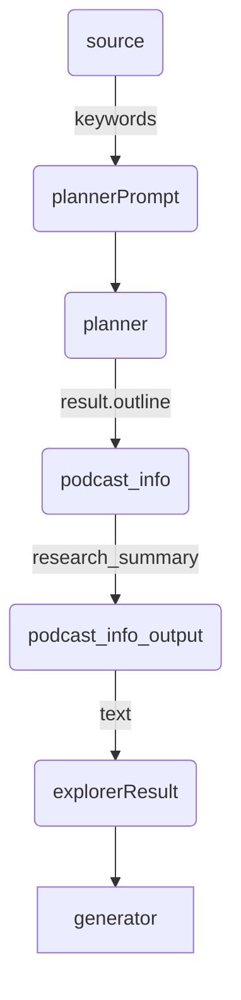
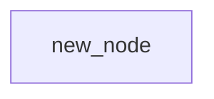

# 全体概要
# 初期セットアップ
## expertAgent
### setup
```bash
cd expertAgent
python3 -m venv venv
source venv/bin/activate  # Windowsの場合: venv\Scripts\activate
pip install --upgrade pip
pip install -r requirements.txt
```

```
# mac
brew install ffmpeg

# linux
sudo apt update
sudo apt install ffmpeg
```

### .env
```
OPENAI_API_KEY=<OPENAI_API_KEY>
GOOGLE_API_KEY=<GOOGLE_API_KEY>
ANTHROPIC_API_KEY=<ANTHROPIC_API_KEY>
GOOGLE_APIS_TOKEN_PATH=./token/token.json
GOOGLE_APIS_CREDENTIALS_PATH=./token/credentials.json
MAIL_TO=<MAIL_TO>
LOG_DIR=./log
LOG_LEVEL=INFO
PODCAST_SCRIPT_DEFAULT_MODEL=gpt-4o-mini
SPREADSHEET_ID=<SPREADSHEET_ID>
GRAPH_AGENT_MODEL=gpt-4o-mini
OLLAMA_URL=http://localhost:11434
OLLAMA_DEF_SMALL_MODEL=gemma3:27b-it-q8_0
EXTRACT_KNOWLEDGE_MODEL=gemma3:27b-it-q8_0
SPREADSHEET_ID=<SPREADSHEET_ID>
MLX_LLM_SERVER_URL=http://localhost:8080
```

### exec
```bash
uvicorn app.main:app --reload
```

```
curl http://127.0.0.1:8000/aiagent-api/v1/


curl -X POST "http://127.0.0.1:8000/aiagent-api/v1/aiagent/sample" \
    -H "Content-Type: application/json" \
    -d '{
      "user_input": "ドラゴンボールの作者をメールで送信して"
    }'
```

## graphAiServer
- yarnのインストール
  ```bash
  brew install yarn
  ```
### setup
```bash
cd graphAiServer
yarn install
```

### exec
```bash
NODE_OPTIONS="--loader ts-node/esm" npx ts-node src/app.js
```

```bash
curl http://localhost:3000/

curl http://localhost:3030/agent/sample/


curl -X POST "http://localhost:3030/agent/sample/" \
    -H "Content-Type: application/json" \
    -d '{
      "user_input": "量子コンピューティング, LLM, AI, ChatGPT",
      "model_name": "podcast_map_test"
    }'

```

# graphAI
## 1. インストール
```
sudo npm i -g  @receptron/graphai_cli
```

## .env
```
OPENAI_API_KEY=<OPENAI_API_KEY>
GOOGLE_GENAI_API_KEY=<GEMINI_API_KEY>
CLAUDE_API_KEY=<CLAUDE_API_KEY>
```



# アーキテクチャ


```bash
# ステップ1: Ollama関連プロセスを停止
pkill -f "/Applications/Ollama-2.app/Contents/Resources/ollama"

# ステップ2 (任意): プロセス終了確認 (数秒待ってから実行)
# ps aux | grep '[O]llama'

# ステップ3: 新しい設定でOllamaサーバーを起動
OLLAMA_NUM_PARALLEL=4 OLLAMA_MAX_LOADED_MODELS=4 OLLAMA_MAX_QUEUE=2048 ollama serve
```


## mlxtest
### setup
```bash
cd mlxtest
python3 -m venv venv
source venv/bin/activate  # Windowsの場合: venv\Scripts\activate
pip install --upgrade pip
pip install -r requirements.txt
```


```bash
mlx_lm.generate --model mlx-community/gemma-3-12b-it-8bit --prompt "あなたは誰？"
```

### exec
```bash
uvicorn server:app --host 0.0.0.0 --port 8080 --loop uvloop --workers 4
```

```bash
curl -X POST http://localhost:8080/v1/completions \
     -H "Content-Type: application/json" \
     -d '{"prompt":"東京から大阪まで何キロ？"}'
```
