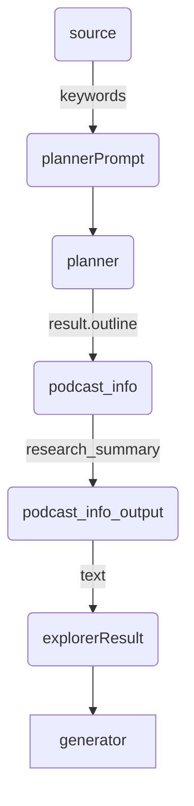

# 全体概要
# 初期セットアップ
## expertAgent
### setup
```bash
cd expertAgent
python3 -m venv venv
source venv/bin/activate  # Windowsの場合: venv\Scripts\activate
pip install --upgrade pip
pip install -r requirements.txt
```

```
# mac
brew install ffmpeg

# linux
sudo apt update
sudo apt install ffmpeg
```

### .env
```
OPENAI_API_KEY=<OPENAI_API_KEY>
GOOGLE_API_KEY=<GOOGLE_API_KEY>
ANTHROPIC_API_KEY=<ANTHROPIC_API_KEY>
GOOGLE_APIS_TOKEN_PATH=./token/token.json
GOOGLE_APIS_CREDENTIALS_PATH=./token/credentials.json
MAIL_TO=<MAIL_TO>
LOG_DIR=./log
LOG_LEVEL=INFO
PODCAST_SCRIPT_DEFAULT_MODEL=gpt-4o-mini
SPREADSHEET_ID=<SPREADSHEET_ID>
GRAPH_AGENT_MODEL=gpt-4o-mini
OLLAMA_URL=http://localhost:11434
OLLAMA_DEF_SMALL_MODEL=gemma3:27b-it-q8_0
EXTRACT_KNOWLEDGE_MODEL=gemma3:27b-it-q8_0
SPREADSHEET_ID=<SPREADSHEET_ID>
MLX_LLM_SERVER_URL=http://localhost:8080
```

### exec
```bash
uvicorn app.main:app --reload
uvicorn app.main:app --workers 5
```

```
curl http://127.0.0.1:8000/aiagent-api/v1/


curl -X POST "http://127.0.0.1:8000/aiagent-api/v1/aiagent/sample" \
    -H "Content-Type: application/json" \
    -d '{
      "user_input": "ドラゴンボールの作者をメールで送信して"
    }'
```

## graphAiServer
- yarnのインストール
  ```bash
  brew install yarn
  ```
### setup
```bash
cd graphAiServer
yarn install
```

### exec
```bash
NODE_OPTIONS="--loader ts-node/esm" npx ts-node src/app.js
```

```bash
curl http://localhost:3000/

curl http://localhost:3030/agent/sample/


curl -X POST "http://localhost:3030/agent/sample/" \
    -H "Content-Type: application/json" \
    -d '{
      "user_input": "量子コンピューティング, LLM, AI, ChatGPT",
      "model_name": "podcast_map_test"
    }'

```

# graphAI
## 1. インストール
```
sudo npm i -g  @receptron/graphai_cli
```

## .env
```
OPENAI_API_KEY=<OPENAI_API_KEY>
GOOGLE_GENAI_API_KEY=<GEMINI_API_KEY>
CLAUDE_API_KEY=<CLAUDE_API_KEY>
```



# アーキテクチャ


```bash
# ステップ1: Ollama関連プロセスを停止
pkill -f "/Applications/Ollama-2.app/Contents/Resources/ollama"

# ステップ2 (任意): プロセス終了確認 (数秒待ってから実行)
# ps aux | grep '[O]llama'

# ステップ3: 新しい設定でOllamaサーバーを起動
OLLAMA_NUM_PARALLEL=4 OLLAMA_MAX_LOADED_MODELS=4 OLLAMA_MAX_QUEUE=2048 ollama serve
```


## mlxtest
### setup
```bash
cd mlxtest
python3 -m venv venv
source venv/bin/activate  # Windowsの場合: venv\Scripts\activate
pip install --upgrade pip
pip install -r requirements.txt
```


```bash
mlx_lm.generate --model mlx-community/gemma-3-12b-it-8bit --prompt "あなたは誰？"
```

### exec
```bash
uvicorn server:app --host 0.0.0.0 --port 8080 --loop uvloop --workers 4
```

```bash
curl -X POST http://localhost:8080/v1/completions \
     -H "Content-Type: application/json" \
     -d '{"prompt":"東京から大阪まで何キロ？"}'
```


    # 命令指示書
    入力情報と制約条件を元に下記手順に従い最高の成果物を生成してください。
    
    1. 入力情報に目を通し、重要な情報が存在しない場合は、"情報なし"と返却すること
    2. 重要度が高い順に最大８つの用語を抽出し一覧化すること。
    3. 用語の意味や概念を整理すること。必要に応じてあなたの知見を付与すること。
    4. 用語同士の関係性を整理すること。
    5. 出力情報から不要な情報を削除すること。

    # 制約条件
    - 日本語で返却すること
    - 出力は RESPONSE_FORMAT に従うこと
    - 返却は JSON 形式で行い、コメントやマークダウンは含めないこと
    - 考察など独自の意見は含めないこと

    # 入力情報
    ```
    {_text}
    ```

    # RESPONSE FORMAT:
    ```json
    {{
        "用語名一覧": [
            "用語の名前",
            ・・・
            ],
        "用語の意味や概念": [
            {{
                "用語名": "用語の名前",
                "用語の説明": "用語の意味や概念や定義。必要に応じて具体例を含む",
            }},
            ・・・
            ],
        "関係性": [
            {{
                "用語1": "用語の名前",
                "用語2": "用語の名前",
                "関係性": "用語1と用語2の関係性"
            }},
            ・・・
            ]
    }}
    ```

# mlx-community/gemma3-12b-it-4bit-DWQ
# mlx-community/gemma-3-12b-it-8bit
# gemma-3-27b-it-8bit
# mlx-community/gemma-3-12b-it-4bit, gemma-3-4b-it-qat-8bit
# mlx-community/Qwen3-8B-4bit
# mlx-community/gemma-3-4b-it-qat-4bit 5G前後
# mlx-community/gemma-3-4b-it-qat-8bit 7G前後
# mlx-community/Mistral-Small-3.1-24B-Instruct-2503-8bit
# mlx-community/Mistral-Small-3.1-Text-24B-Instruct-2503-8bit
# mlx-community/Phi-4-mini-reasoning-8bit
# MODEL_DIR = "mlx-community/gemma-3-4b-it-qat-4bit"
# GPU_SLOTS = 5  # 12B-8bit はメモリ食いなので 1 スロット推奨。実験的に増やせる可能性あり。
# BATCH_MAX_SIZE = 5  # 1バッチあたりの最大リクエスト数（チューニング可能）
# BATCH_TIMEOUT_SECONDS = 1.5  # バッチ処理のタイムアウト（秒、チューニング可能）
# VERBOSE = False  # デバッグ用の詳細出力を有効にするかどうか

# mlx-community/gemma-3-12b-it-4bit-DWQ 10G前後
# mlx-community/Qwen3-8B-4bit-DWQ

Qwen3-8B-8bit
gemma-3-27b-it-8bit
mlx-community/Qwen3-4B-8bit


国科学技術大学を中心とする研究チームが発表した論文「Exploring the boundary of quantum correlations with a time-domain optical processor」は、光子を使った量子物理学の実験で、37次元という極めて複雑な状態を作り出すことに成功した研究報告である。

　研究チームが焦点を当てたのは、グリーンバーガー・ホーン・ツァイリンガー（GHZ）タイプのパラドックスと呼ばれる現象だ。このパラドックスは量子測定の文脈依存性を示すもので、量子力学の基本的な特徴を明らかにする重要な実験として知られている。

　文脈依存性とは、ある物理量の測定結果が、同時に測定する他の物理量（文脈）の選び方によって変化してしまう性質である。今回の研究では、理論的に可能な最小数である3つの文脈でGHZタイプのパラドックスを初めて実現することに成功した。


3つの文脈をもつGHZ型パラドックス
　実験では、光ファイバーを使った装置を開発。時間領域で多重化された光パルスを用いることで37次元の量子状態を作り出し、その状態を精密に測定することに成功している。特に、強いコヒーレント光（参照光）を用いることで、量子状態の振幅と位相の完全な情報を抽出することを可能にした。


実験セットアップ
　実験結果は量子理論の予測と極めて良い一致を示し、古典的な理論の予測とは明確に異なることを実証している。測定の不完全さを考慮に入れても、古典理論では説明できない結果が統計的に有意な形で得られた。


## 1.用語名一覧:
- 量子物理学
- グリーンバーガー・ホーン・ツァイリンガー（GHZ）タイプのパラドックス
- 量子測定の文脈依存性

## 2.用語の意味や概念:
- 量子物理学: 光子を使った実験が行われる分野であり、本研究では37次元という極めて複雑な状態を作り出すことに成功したと報告されている。
- グリーンバーガー・ホーン・ツァイリンガー（GHZ）タイプのパラドックス: 量子測定の文脈依存性を示す現象であり、量子力学の基本的な特徴を明らかにする重要な実験として知られている。
- 量子測定の文脈依存性: グリーンバーガー・ホーン・ツァイリンガー（GHZ）タイプのパラドックスによって示される、量子力学の基本的な特徴の一つ。

## 3.事実:
- **誰が・何を・どのように・いくつ:** 国科学技術大学を中心とする研究チームが、光子を使った量子物理学の実験において、37次元という極めて複雑な状態を作り出すことに成功した。
- **誰が・何に・なぜ:** 同研究チームは、グリーンバーガー・ホーン・ツァイリンガー（GHZ）タイプのパラドックスと呼ばれる現象に焦点を当てた。これは、その現象が量子測定の文脈依存性を示すためである。
- **誰が・何を:** 国科学技術大学を中心とする研究チームが、「Exploring the boundary of quantum correlations with a time-domain optical processor」という論文を発表した。


## 1.用語名一覧:
- "量子物理学"
- "光子"
- "グリーンバーガー・ホーン・ツァイリンガー（GHZ）タイプのパラドックス"
- "量子測定の文脈依存性"

## 2.用語の意味や概念:
- "量子物理学": 記事によれば、光子を使った実験が行われる物理学の一分野であり、その実験は量子力学の基本的な特徴を明らかにすることに関連しています。
- "光子": 記事によれば、量子物理学の実験において使用されたものです。
- "グリーンバーガー・ホーン・ツァイリンガー（GHZ）タイプのパラドックス": 記事によれば、研究チームが焦点を当てた現象であり、量子測定の文脈依存性を示すもので、量子力学の基本的な特徴を明らかにする重要な実験として知られています。
- "量子測定の文脈依存性": 記事によれば、グリーンバーガー・ホーン・ツァイリンガー（GHZ）タイプのパラドックスが示す、量子力学における測定の性質の一つです。

## 3.事実:
- 国科学技術大学を中心とする研究チームが、論文「Exploring the boundary of quantum correlations with a time-domain optical processor」を発表しました。
- 研究チームは、光子を使った量子物理学の実験において、37次元という極めて複雑な状態を作り出すことに成功しました。
- この研究チームは、グリーンバーガー・ホーン・ツァイリンガー（GHZ）タイプのパラドックスと呼ばれる現象に焦点を当てて研究を行いました。
- グリーンバーガー・ホーン・ツァイリンガー（GHZ）タイプのパラドックスは、量子測定の文脈依存性を示すものであり、量子力学の基本的な特徴を明らかにする重要な実験として知られています。

worker = 5
MODEL_DIR=mlx-community/gemma-3-4b-it-qat-4bit
GPU_SLOTS=5
BATCH_MAX_SIZE=5
BATCH_TIMEOUT_SECONDS=1.5
VERBOSE=False
--- Summary of All Runs ---
| Concurrency | Wall Time (s) | Avg Latency (s) | P95 Latency (s) | Prompt Tokens | Compl Tokens | Prompt TPS | Compl TPS | Reqs (Succ/Att) |
|-------------------------------------------------------------------------------------------------------------------------------------------|
| 1           | 4.203         | 4.203           | 4.203           | 1950          | 371          | 463.91     | 88.26      | 1/1             |
| 10          | 25.547        | 16.728          | 25.545          | 19500         | 3260         | 763.30     | 127.61     | 10/10           |
| 20          | 51.329        | 27.748          | 51.327          | 39000         | 6445         | 759.80     | 125.56     | 20/20           |
| 30          | 75.393        | 40.341          | 70.519          | 58500         | 9633         | 775.94     | 127.77     | 30/30           |
| 40          | 105.043       | 52.425          | 100.151         | 78000         | 12745        | 742.56     | 121.33     | 40/40           |
| 50          | 125.748       | 66.518          | 117.608         | 97500         | 15989        | 775.36     | 127.15     | 50/50           |
| 60          | 153.263       | 76.618          | 146.904         | 117000        | 18993        | 763.39     | 123.92     | 60/60           |

worker = 5
MODEL_DIR=mlx-community/gemma-3-4b-it-qat-4bit
GPU_SLOTS=8
BATCH_MAX_SIZE=8
BATCH_TIMEOUT_SECONDS=1.5
VERBOSE=False
--- Summary of All Runs ---
| Concurrency | Wall Time (s) | Avg Latency (s) | P95 Latency (s) | Prompt Tokens | Compl Tokens | Prompt TPS | Compl TPS | Reqs (Succ/Att) |
|-------------------------------------------------------------------------------------------------------------------------------------------|
| 1           | 3.843         | 3.843           | 3.843           | 1950          | 365          | 507.38     | 94.97      | 1/1             |
| 10          | 30.874        | 17.149          | 30.873          | 19500         | 3681         | 631.60     | 119.23     | 10/10           |
| 20          | 59.225        | 31.490          | 59.220          | 39000         | 7463         | 658.51     | 126.01     | 20/20           |
| 30          | 84.763        | 42.887          | 81.104          | 58500         | 10718        | 690.16     | 126.45     | 30/30           |
| 40          | 111.253       | 56.434          | 107.397         | 78000         | 14305        | 701.10     | 128.58     | 40/40           |
| 50          | 148.157       | 70.858          | 140.653         | 97500         | 17976        | 658.09     | 121.33     | 50/50           |
| 60          | 166.852       | 82.358          | 159.848         | 117000        | 21603        | 701.22     | 129.47     | 60/60           |

worker = 6
MODEL_DIR=mlx-community/gemma-3-4b-it-qat-4bit
GPU_SLOTS=5
BATCH_MAX_SIZE=5
BATCH_TIMEOUT_SECONDS=1.5
VERBOSE=False
--- Summary of All Runs ---
| Concurrency | Wall Time (s) | Avg Latency (s) | P95 Latency (s) | Prompt Tokens | Compl Tokens | Prompt TPS | Compl TPS | Reqs (Succ/Att) |
|-------------------------------------------------------------------------------------------------------------------------------------------|
| 1           | 4.665         | 4.665           | 4.665           | 1950          | 405          | 417.99     | 86.81      | 1/1             |
| 10          | 34.507        | 18.238          | 34.504          | 19500         | 4014         | 565.11     | 116.33     | 10/10           |
| 20          | 63.442        | 32.893          | 63.437          | 39000         | 8078         | 614.74     | 127.33     | 20/20           |
| 30          | 88.242        | 46.181          | 84.479          | 58500         | 12165        | 662.95     | 137.86     | 30/30           |
| 40          | 124.389       | 62.306          | 120.605         | 78000         | 16189        | 627.06     | 130.15     | 40/40           |
| 50          | 157.068       | 75.897          | 147.777         | 97500         | 20197        | 620.75     | 128.59     | 50/50           |
| 60          | 181.644       | 89.038          | 174.348         | 117000        | 24100        | 644.12     | 132.68     | 60/60           |

worker = 4
MODEL_DIR=mlx-community/gemma-3-4b-it-qat-4bit
GPU_SLOTS=5
BATCH_MAX_SIZE=5
BATCH_TIMEOUT_SECONDS=1.5
VERBOSE=False
--- Summary of All Runs ---
| Concurrency | Wall Time (s) | Avg Latency (s) | P95 Latency (s) | Prompt Tokens | Compl Tokens | Prompt TPS | Compl TPS | Reqs (Succ/Att) |
|-------------------------------------------------------------------------------------------------------------------------------------------|
| 1           | 4.621         | 4.620           | 4.620           | 1950          | 355          | 422.02     | 76.83      | 1/1             |
| 10          | 30.553        | 17.016          | 30.550          | 19500         | 3465         | 638.24     | 113.41     | 10/10           |
| 20          | 57.910        | 29.757          | 57.907          | 39000         | 6830         | 673.46     | 117.94     | 20/20           |
| 30          | 82.411        | 41.288          | 79.076          | 58500         | 9902         | 709.86     | 120.15     | 30/30           |
| 40          | 119.230       | 56.805          | 116.134         | 78000         | 13276        | 654.20     | 111.35     | 40/40           |
| 50          | 145.510       | 69.004          | 136.675         | 97500         | 16842        | 670.06     | 115.75     | 50/50           |
| 60          | 166.175       | 80.092          | 157.877         | 117000        | 19950        | 704.08     | 120.05     | 60/60           |å


worker = 5
MODEL_DIR=mlx-community/gemma-3-4b-it-qat-4bit
GPU_SLOTS=5
BATCH_MAX_SIZE=5
BATCH_TIMEOUT_SECONDS=2.0
VERBOSE=False
--- Summary of All Runs ---
| Concurrency | Wall Time (s) | Avg Latency (s) | P95 Latency (s) | Prompt Tokens | Compl Tokens | Prompt TPS | Compl TPS | Reqs (Succ/Att) |
|-------------------------------------------------------------------------------------------------------------------------------------------|
| 1           | 4.332         | 4.332           | 4.332           | 1950          | 294          | 450.18     | 67.87      | 1/1             |
| 10          | 26.017        | 15.713          | 26.016          | 19500         | 3246         | 749.51     | 124.76     | 10/10           |
| 20          | 58.690        | 29.345          | 58.686          | 39000         | 6780         | 664.51     | 115.52     | 20/20           |
| 30          | 78.641        | 41.609          | 75.231          | 58500         | 10061        | 743.89     | 127.94     | 30/30           |
| 40          | 100.513       | 54.114          | 100.433         | 78000         | 13525        | 776.02     | 134.56     | 40/40           |
| 50          | 136.647       | 66.517          | 127.612         | 97500         | 16555        | 713.52     | 121.15     | 50/50           |
| 60          | 150.650       | 79.615          | 146.442         | 117000        | 20590        | 776.64     | 136.67     | 60/60           |


worker = 4
MODEL_DIR=mlx-community/gemma-3-4b-it-qat-4bit
GPU_SLOTS=5
BATCH_MAX_SIZE=5
BATCH_TIMEOUT_SECONDS=2.0
VERBOSE=False
--- Summary of All Runs ---
| Concurrency | Wall Time (s) | Avg Latency (s) | P95 Latency (s) | Prompt Tokens | Compl Tokens | Prompt TPS | Compl TPS | Reqs (Succ/Att) |
|-------------------------------------------------------------------------------------------------------------------------------------------|
| 1           | 4.544         | 4.544           | 4.544           | 1950          | 363          | 429.10     | 79.88      | 1/1             |
| 10          | 28.241        | 17.271          | 28.240          | 19500         | 3566         | 690.49     | 126.27     | 10/10           |
| 20          | 59.511        | 30.179          | 59.506          | 39000         | 6913         | 655.35     | 116.16     | 20/20           |
| 30          | 78.376        | 42.146          | 73.126          | 58500         | 10377        | 746.41     | 132.40     | 30/30           |
| 40          | 105.340       | 55.074          | 101.602         | 78000         | 14040        | 740.46     | 133.28     | 40/40           |
| 50          | 145.550       | 70.107          | 138.793         | 97500         | 17489        | 669.87     | 120.16     | 50/50           |
| 60          | 158.749       | 80.742          | 151.895         | 117000        | 20905        | 737.01     | 131.69     | 60/60           |


worker = 5
MODEL_DIR=mlx-community/gemma-3-4b-it-qat-4bit
GPU_SLOTS=5
BATCH_MAX_SIZE=5
BATCH_TIMEOUT_SECONDS=2.0
VERBOSE=False
--- Summary of All Runs ---
| Concurrency | Wall Time (s) | Avg Latency (s) | P95 Latency (s) | Prompt Tokens | Compl Tokens | Prompt TPS | Compl TPS | Reqs (Succ/Att) |
|-------------------------------------------------------------------------------------------------------------------------------------------|
| 1           | 3.343         | 3.343           | 3.343           | 1950          | 290          | 583.34     | 86.75      | 1/1             |
| 10          | 25.153        | 15.336          | 25.150          | 19500         | 3180         | 775.25     | 126.43     | 10/10           |
| 20          | 57.903        | 28.476          | 57.899          | 39000         | 6496         | 673.54     | 112.19     | 20/20           |
| 30          | 77.101        | 40.843          | 74.801          | 58500         | 10006        | 758.74     | 129.78     | 30/30           |
| 40          | 100.924       | 53.658          | 97.474          | 78000         | 13377        | 772.86     | 132.55     | 40/40           |
| 50          | 134.381       | 66.711          | 125.246         | 97500         | 16836        | 725.55     | 125.29     | 50/50           |
| 60          | 161.770       | 79.566          | 155.169         | 117000        | 20188        | 723.25     | 124.79     | 60/60           |

worker = 8
MODEL_DIR=mlx-community/gemma-3-4b-it-qat-4bit
GPU_SLOTS=5
BATCH_MAX_SIZE=5
BATCH_TIMEOUT_SECONDS=1.0
VERBOSE=False
--- Summary of All Runs ---
| Concurrency | Wall Time (s) | Avg Latency (s) | P95 Latency (s) | Prompt Tokens | Compl Tokens | Prompt TPS | Compl TPS | Reqs (Succ/Att) |
|-------------------------------------------------------------------------------------------------------------------------------------------|
| 1           | 3.695         | 3.695           | 3.695           | 1950          | 360          | 527.75     | 97.43      | 1/1             |
| 10          | 25.631        | 18.663          | 25.628          | 19500         | 3457         | 760.81     | 134.88     | 10/10           |
| 20          | 54.811        | 31.008          | 54.806          | 39000         | 6621         | 711.54     | 120.80     | 20/20           |
| 30          | 78.851        | 42.664          | 74.469          | 58500         | 10124        | 741.90     | 128.39     | 30/30           |
| 40          | 105.217       | 55.148          | 101.784         | 78000         | 13715        | 741.32     | 130.35     | 40/40           |
| 50          | 128.483       | 68.813          | 121.786         | 97500         | 16929        | 758.86     | 131.76     | 50/50           |
| 60          | 152.944       | 80.299          | 146.518         | 117000        | 20480        | 764.99     | 133.91     | 60/60           |

worker = 3
MODEL_DIR=mlx-community/gemma-3-4b-it-qat-4bit
GPU_SLOTS=5
BATCH_MAX_SIZE=5
BATCH_TIMEOUT_SECONDS=1.0
VERBOSE=False
--- Summary of All Runs ---
| Concurrency | Wall Time (s) | Avg Latency (s) | P95 Latency (s) | Prompt Tokens | Compl Tokens | Prompt TPS | Compl TPS | Reqs (Succ/Att) |
|-------------------------------------------------------------------------------------------------------------------------------------------|
| 1           | 4.281         | 4.281           | 4.281           | 1950          | 326          | 455.47     | 76.14      | 1/1             |
| 10          | 27.972        | 15.467          | 27.971          | 19500         | 3190         | 697.13     | 114.04     | 10/10           |
| 20          | 56.852        | 28.616          | 56.848          | 39000         | 6617         | 685.99     | 116.39     | 20/20           |
| 30          | 91.512        | 44.745          | 88.232          | 58500         | 10115        | 639.26     | 110.53     | 30/30           |
| 40          | 103.308       | 53.332          | 99.793          | 78000         | 13543        | 755.02     | 131.09     | 40/40           |
| 50          | 138.482       | 67.600          | 130.498         | 97500         | 16981        | 704.06     | 122.62     | 50/50           |
| 60          | 161.319       | 80.140          | 154.549         | 117000        | 20625        | 725.27     | 127.85     | 60/60           |


worker = 5
MODEL_DIR=mlx-community/gemma-3-4b-it-qat-8bit
GPU_SLOTS=5
BATCH_MAX_SIZE=5
BATCH_TIMEOUT_SECONDS=2.0
VERBOSE=False
--- Summary of All Runs ---
| Concurrency | Wall Time (s) | Avg Latency (s) | P95 Latency (s) | Prompt Tokens | Compl Tokens | Prompt TPS | Compl TPS | Reqs (Succ/Att) |
|-------------------------------------------------------------------------------------------------------------------------------------------|
| 1           | 4.775         | 4.775           | 4.775           | 1950          | 355          | 408.36     | 74.34      | 1/1             |
| 10          | 35.294        | 23.099          | 35.292          | 19500         | 3520         | 552.51     | 99.73      | 10/10           |
| 20          | 70.318        | 39.508          | 70.316          | 39000         | 7198         | 554.62     | 102.36     | 20/20           |


worker = 5
MODEL_DIR=mlx-community/gemma-3-12b-it-4bit
GPU_SLOTS=5
BATCH_MAX_SIZE=5
BATCH_TIMEOUT_SECONDS=2.0
VERBOSE=False
--- Summary of All Runs ---
| Concurrency | Wall Time (s) | Avg Latency (s) | P95 Latency (s) | Prompt Tokens | Compl Tokens | Prompt TPS | Compl TPS | Reqs (Succ/Att) |
|-------------------------------------------------------------------------------------------------------------------------------------------|
| 1           | 11.638        | 11.638          | 11.638          | 1950          | 465          | 167.56     | 39.96      | 1/1             |
| 10          | 89.203        | 54.009          | 89.202          | 19500         | 5037         | 218.60     | 56.47      | 10/10           |
| 20          | 193.441       | 99.296          | 193.437         | 39000         | 9734         | 201.61     | 50.32      | 20/20           |


worker = 5
MODEL_DIR=mlx-community/Qwen3-8B-4bit
GPU_SLOTS=5
BATCH_MAX_SIZE=5
BATCH_TIMEOUT_SECONDS=2.0
VERBOSE=False
/no_think　あり
--- Summary of All Runs ---
| Concurrency | Wall Time (s) | Avg Latency (s) | P95 Latency (s) | Prompt Tokens | Compl Tokens | Prompt TPS | Compl TPS | Reqs (Succ/Att) |
|-------------------------------------------------------------------------------------------------------------------------------------------|
| 1           | 7.849         | 7.849           | 7.849           | 2375          | 423          | 302.60     | 53.89      | 1/1             |
| 10          | 59.904        | 34.439          | 59.902          | 23750         | 4417         | 396.47     | 73.74      | 10/10           |
| 20          | 122.273       | 64.125          | 122.271         | 47500         | 9098         | 388.47     | 74.41      | 20/20           |
--- Summary of All Runs ---
| Concurrency | Wall Time (s) | Avg Latency (s) | P95 Latency (s) | Prompt Tokens | Compl Tokens | Prompt TPS | Compl TPS | Reqs (Succ/Att) |
|-------------------------------------------------------------------------------------------------------------------------------------------|
| 1           | 6.601         | 6.601           | 6.601           | 2375          | 439          | 359.80     | 66.51      | 1/1             |
| 5           | 32.174        | 20.324          | 32.173          | 11875         | 2405         | 369.09     | 74.75      | 5/5             |
| 10          | 66.029        | 36.770          | 66.028          | 23750         | 4575         | 359.69     | 69.29      | 10/10           |
| 20          | 115.060       | 63.742          | 115.055         | 47500         | 9347         | 412.83     | 81.24      | 20/20           |


worker = 5
MODEL_DIR=mlx-community/Qwen3-8B-4bit
GPU_SLOTS=5
BATCH_MAX_SIZE=5
BATCH_TIMEOUT_SECONDS=2.0
VERBOSE=False
/no_think　なし
--- Summary of All Runs ---
| Concurrency | Wall Time (s) | Avg Latency (s) | P95 Latency (s) | Prompt Tokens | Compl Tokens | Prompt TPS | Compl TPS | Reqs (Succ/Att) |
|-------------------------------------------------------------------------------------------------------------------------------------------|
| 1           | 9.085         | 9.085           | 9.085           | 2368          | 512          | 260.65     | 56.36      | 1/1             |
| 10          | 67.960        | 36.837          | 67.958          | 23680         | 5120         | 348.44     | 75.34      | 10/10           |
| 20          | 124.387       | 64.759          | 124.383         | 47360         | 10240        | 380.75     | 82.32      | 20/20           |
--- Summary of All Runs ---
| Concurrency | Wall Time (s) | Avg Latency (s) | P95 Latency (s) | Prompt Tokens | Compl Tokens | Prompt TPS | Compl TPS | Reqs (Succ/Att) |
|-------------------------------------------------------------------------------------------------------------------------------------------|
| 1           | 12.493        | 12.493          | 12.493          | 2368          | 871          | 189.55     | 69.72      | 1/1             |
| 5           | 51.608        | 34.513          | 51.607          | 11840         | 4722         | 229.42     | 91.50      | 5/5             |
| 10          | 110.850       | 59.494          | 110.849         | 23680         | 9435         | 213.62     | 85.12      | 10/10           |
| 20          | 196.904       | 111.350         | 196.899         | 47360         | 19383        | 240.52     | 98.44      | 20/20           |

worker = 5
MODEL_DIR=mlx-community/gemma-3-4b-it-qat-4bit
GPU_SLOTS=5
BATCH_MAX_SIZE=5
BATCH_TIMEOUT_SECONDS=2.0
VERBOSE=False
--- Summary of All Runs ---
| Concurrency | Wall Time (s) | Avg Latency (s) | P95 Latency (s) | Prompt Tokens | Compl Tokens | Prompt TPS | Compl TPS | Reqs (Succ/Att) |
|-------------------------------------------------------------------------------------------------------------------------------------------|
| 1           | 5.571         | 5.571           | 5.571           | 1498          | 632          | 268.87     | 113.43     | 1/1             |
| 5           | 20.279        | 16.195          | 20.278          | 7490          | 3376         | 369.34     | 166.47     | 5/5             |
| 10          | 37.670        | 25.454          | 37.668          | 14980         | 6945         | 397.67     | 184.37     | 10/10           |
| 20          | 75.315        | 41.319          | 75.311          | 29960         | 12913        | 397.80     | 171.45     | 20/20           |


worker = 5
MODEL_DIR=mlx-community/gemma-3-4b-it-4bit-DWQ
GPU_SLOTS=5
BATCH_MAX_SIZE=5
BATCH_TIMEOUT_SECONDS=2.0
VERBOSE=False
--- Summary of All Runs ---
| Concurrency | Wall Time (s) | Avg Latency (s) | P95 Latency (s) | Prompt Tokens | Compl Tokens | Prompt TPS | Compl TPS | Reqs (Succ/Att) |
|-------------------------------------------------------------------------------------------------------------------------------------------|
| 1           | 4.565         | 4.564           | 4.564           | 1498          | 324          | 328.18     | 70.98      | 1/1             |
| 5           | 14.889        | 9.223           | 14.888          | 7490          | 1630         | 503.05     | 109.47     | 5/5             |
| 10          | 27.384        | 14.437          | 27.383          | 14980         | 3411         | 547.04     | 124.56     | 10/10           |
| 20          | 55.803        | 27.244          | 55.802          | 29960         | 6876         | 536.88     | 123.22     | 20/20           |


worker = 5
MODEL_DIR=mlx-community/gemma-3-12b-it-4bit-DWQ
GPU_SLOTS=5
BATCH_MAX_SIZE=5
BATCH_TIMEOUT_SECONDS=2.0
VERBOSE=False
--- Summary of All Runs ---
| Concurrency | Wall Time (s) | Avg Latency (s) | P95 Latency (s) | Prompt Tokens | Compl Tokens | Prompt TPS | Compl TPS | Reqs (Succ/Att) |
|-------------------------------------------------------------------------------------------------------------------------------------------|
| 1           | 10.630        | 10.630          | 10.630          | 1498          | 417          | 140.92     | 39.23      | 1/1             |
| 5           | 37.205        | 25.309          | 37.204          | 7490          | 2011         | 201.32     | 54.05      | 5/5             |
| 10          | 73.049        | 46.558          | 73.046          | 14980         | 4414         | 205.07     | 60.43      | 10/10           |
| 20          | 154.553       | 82.669          | 154.548         | 29960         | 8456         | 193.85     | 54.71      | 20/20           |

MODEL_DIR=mlx-community/Qwen3-8B-4bit-DWQ
GPU_SLOTS=5
BATCH_MAX_SIZE=5
BATCH_TIMEOUT_SECONDS=2.0
VERBOSE=False


# バッチなし
worker = 1
MODEL_DIR=mlx-community/gemma-3-4b-it-4bit-DWQ
GPU_SLOTS=1
BATCH_MAX_SIZE=1
BATCH_TIMEOUT_SECONDS=0.1
VERBOSE=False
--- Summary of All Runs ---
| Concurrency | Wall Time (s) | Avg Latency (s) | P95 Latency (s) | Prompt Tokens | Compl Tokens | Prompt TPS | Compl TPS | Reqs (Succ/Att) |
|-------------------------------------------------------------------------------------------------------------------------------------------|
| 1           | 3.248         | 3.248           | 3.248           | 1546          | 337          | 475.99     | 103.76     | 1/1             |
| 5           | 14.987        | 8.993           | 14.985          | 7730          | 1551         | 515.79     | 103.49     | 5/5             |
| 10          | 30.647        | 16.878          | 30.646          | 15460         | 3216         | 504.45     | 104.94     | 10/10           |
| 15          | 44.738        | 23.919          | 44.735          | 23190         | 4643         | 518.35     | 103.78     | 15/15           |
| 20          | 60.822        | 31.919          | 60.820          | 30920         | 6380         | 508.37     | 104.90     | 20/20           |

# バッチあり
worker = 1
MODEL_DIR=mlx-community/gemma-3-4b-it-4bit-DWQ
GPU_SLOTS=1
BATCH_MAX_SIZE=5
BATCH_TIMEOUT_SECONDS=1.0
VERBOSE=False
--- Summary of All Runs ---
| Concurrency | Wall Time (s) | Avg Latency (s) | P95 Latency (s) | Prompt Tokens | Compl Tokens | Prompt TPS | Compl TPS | Reqs (Succ/Att) |
|-------------------------------------------------------------------------------------------------------------------------------------------|
| 1           | 4.025         | 4.025           | 4.025           | 1546          | 305          | 384.13     | 75.78      | 1/1             |
| 5           | 14.829        | 9.006           | 14.828          | 7730          | 1535         | 521.26     | 103.51     | 5/5             |
| 10          | 28.950        | 16.196          | 28.949          | 15460         | 2982         | 534.03     | 103.01     | 10/10           |
| 15          | 45.953        | 24.630          | 45.950          | 23190         | 4846         | 504.64     | 105.45     | 15/15           |
| 20          | 61.023        | 31.858          | 61.022          | 30920         | 6430         | 506.70     | 105.37     | 20/20           |

# 並列あり
worker = 3
MODEL_DIR=mlx-community/gemma-3-4b-it-4bit-DWQ
GPU_SLOTS=5
BATCH_MAX_SIZE=5
BATCH_TIMEOUT_SECONDS=1.0
VERBOSE=False
--- Summary of All Runs ---
| Concurrency | Wall Time (s) | Avg Latency (s) | P95 Latency (s) | Prompt Tokens | Compl Tokens | Prompt TPS | Compl TPS | Reqs (Succ/Att) |
|-------------------------------------------------------------------------------------------------------------------------------------------|
| 1           | 3.588         | 3.588           | 3.588           | 1546          | 299          | 430.87     | 83.33      | 1/1             |
| 5           | 11.335        | 8.845           | 11.333          | 7730          | 1522         | 681.99     | 134.28     | 5/5             |
| 10          | 28.345        | 15.227          | 28.342          | 15460         | 3202         | 545.42     | 112.96     | 10/10           |
| 15          | 37.848        | 20.143          | 37.847          | 23190         | 4648         | 612.71     | 122.81     | 15/15           |
| 20          | 52.552        | 26.526          | 52.548          | 30920         | 6166         | 588.36     | 117.33     | 20/20           |

# 並列あり
worker = 3
MODEL_DIR=mlx-community/gemma-3-4b-it-4bit-DWQ
GPU_SLOTS=1
BATCH_MAX_SIZE=1
BATCH_TIMEOUT_SECONDS=0.1
VERBOSE=False
--- Summary of All Runs ---
| Concurrency | Wall Time (s) | Avg Latency (s) | P95 Latency (s) | Prompt Tokens | Compl Tokens | Prompt TPS | Compl TPS | Reqs (Succ/Att) |
|-------------------------------------------------------------------------------------------------------------------------------------------|
| 1           | 3.044         | 3.044           | 3.044           | 1546          | 309          | 507.85     | 101.50     | 1/1             |
| 5           | 10.996        | 8.536           | 10.995          | 7730          | 1557         | 702.97     | 141.59     | 5/5             |
| 10          | 24.611        | 13.975          | 24.611          | 15460         | 3163         | 628.17     | 128.52     | 10/10           |
| 15          | 41.736        | 21.571          | 41.735          | 23190         | 4974         | 555.64     | 119.18     | 15/15           |
| 20          | 49.386        | 25.739          | 49.381          | 30920         | 6482         | 626.08     | 131.25     | 20/20           |

# 並列あり
worker = 5
MODEL_DIR=mlx-community/gemma-3-4b-it-4bit-DWQ
GPU_SLOTS=1
BATCH_MAX_SIZE=1
BATCH_TIMEOUT_SECONDS=0.1
VERBOSE=False
--- Summary of All Runs ---
| Concurrency | Wall Time (s) | Avg Latency (s) | P95 Latency (s) | Prompt Tokens | Compl Tokens | Prompt TPS | Compl TPS | Reqs (Succ/Att) |
|-------------------------------------------------------------------------------------------------------------------------------------------|
| 1           | 3.257         | 3.256           | 3.256           | 1546          | 290          | 474.73     | 89.05      | 1/1             |
| 5           | 11.427        | 8.713           | 11.426          | 7730          | 1606         | 676.48     | 140.55     | 5/5             |
| 10          | 23.471        | 13.945          | 23.469          | 15460         | 3240         | 658.68     | 138.04     | 10/10           |
| 15          | 38.040        | 19.823          | 38.037          | 23190         | 4861         | 609.62     | 127.79     | 15/15           |
| 20          | 46.671        | 26.936          | 46.671          | 30920         | 6667         | 662.51     | 142.85     | 20/20           |
