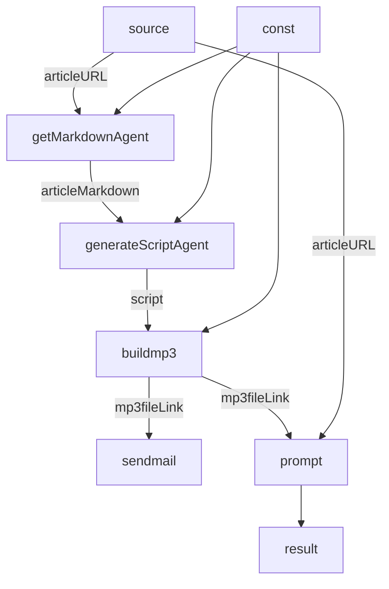

# setup
```bash
cd graphAiBuilder/
npm install
npm run build
```

# edit
## vscode
- Mermaid Graphical Editor

## sample.mmd


# exec
```bash
node dist/graphaibuilder.js mermaid2yaml -input sample.mmd -output graph3.yaml
```

